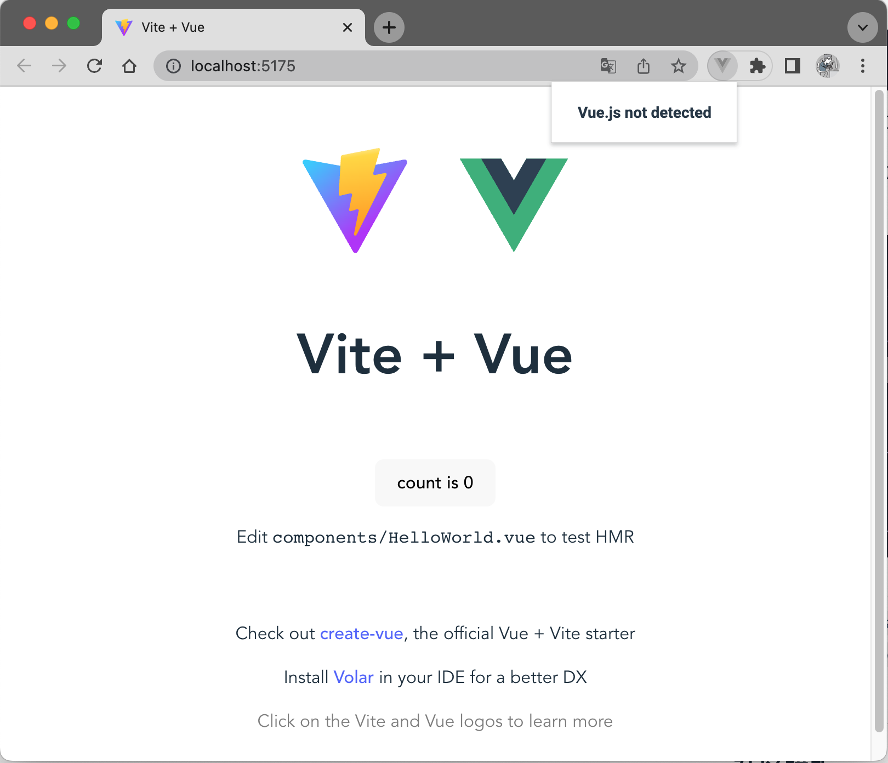

# Vue3 如何禁止 vue-devtools 检测

## 介绍
chrome 插件 Vue.js devtools 是可以检测当前网页是否使用 Vue 进行开发。

下面将介绍 Vue.js devtools 是如何检测页面是使用 Vue 开发的，并且如何让 Vue.js devtools 检测失败。

## Vue.js devtools 检测原理
检测代码在 [detector.js](https://github.com/vuejs/devtools/blob/main/packages/shell-chrome/src/detector.js) 中

查看代码可知，检测分为三个部分
#### 1、nuxt.js 检测
检测 window 下是否有 `__NUXT__` 或 `$nuxt` 标志位，来判断是否是 nuxt
```js
// Method 1: Check Nuxt.js
const nuxtDetected = !!(window.__NUXT__ || window.$nuxt)
```
#### 2、vue3 检测
检测 window 下是否有 `__VUE__ `来判断是否是 vue3
```js
// Method 2: Check  Vue 3
const vueDetected = !!(window.__VUE__)
```
#### 3、扫描全部节点
扫描全部节点，判断节点是否有 `__vue__` 属性，来判断是否是 vue2
```js
// Method 3: Scan all elements inside document
const all = document.querySelectorAll('*')
let el
for (let i = 0; i < all.length; i++) {
  if (all[i].__vue__) {
    el = all[i]
    break
  }
}
```

## Vue3 如何禁止 vue-devtools 检测
因为 vue3 中是通过检测 window 下是否有 `__VUE__ `来判断是否是 vue3

所以只需要在页面渲染后修改 `__VUE__` 就可以规避检测

```js
import { createApp } from 'vue'
import './style.css'
import App from './App.vue'

// 创建 createApp 会将 __VUE__ 设置为 true
createApp(App).mount('#app')
// 在 createApp 之后修改 __VUE__ 为 false
window.__VUE__ = false;
```
