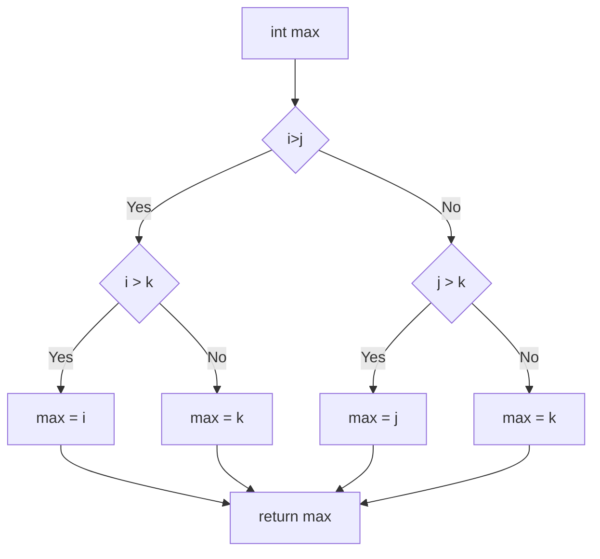

# 如何判断代码复杂度

## 介绍
本文通过介绍如何使用 McCabe 度量法，来计算圈复杂度 (Cyclomatic complexity)；并介绍其在前端中的实际应用。

## McCabe 度量法
McCabe 度量法是一种基于程度控制流的复杂度量方法，该方法认为程序的复杂性很大程度上取决于控制的复杂性。首先根据程序画出程序图，然后基于图论用图的环路数来度量程序的复杂性，即 V(G)=m-n+2p ,其中 m、n 和 p 分别表示图 G 中弧的个数、顶点的个数和强连通分量数。由于程序转化出来的程序图正常情况下强连通分量数都是 1，所以可以简化为 V(G)=m-n+2。

## 如何使用 McCabe 度量法计算圈复杂度
下面通过一道软件工程师的考试题目来介绍如何计算圈复杂度

(2015年上半年软考中级题目)若采用白盒测试方法测试以下代码，并满足条件覆盖，则至少需要___个测试用例。采用McCabe度量法算出该程序的环路复杂性为___。
```c
int find_max(int i, int j, int k){
    int max;
    if(i > j) {
        if(i > k){
           max = i;
        } else {
           max = k;
        }
    } else {
        if(j > k) {
            max = j;
        } else {
            max = k;
        }
    }
    return max;
}
```
先画出该代码的流程图，如下：

根据McCabe度量法环路复杂性公式V(G)=M-N+2,图中M(弧的个数)=11，N(顶点的个数)=9，V(G)=11-9+2=4


## 项目中的实际应用
根据需求开启 eslint 的 [complexity](https://eslint.org/docs/latest/rules/complexity)；默认阈值 20；超出将会发出警告。

## 参考资料

[1] 前端代码质量-圈复杂度原理和实践: [https://juejin.cn/post/6844903965792927751](https://juejin.cn/post/6844903965792927751)

[2] complexity: [https://eslint.org/docs/latest/rules/complexity](https://eslint.org/docs/latest/rules/complexity)