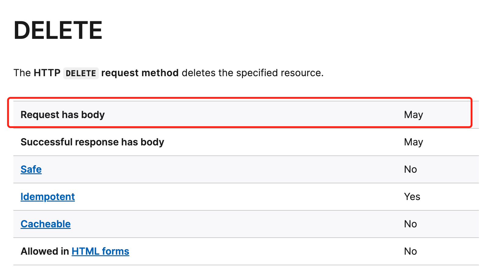

# 前端安全相关处理

前端安全是指保护网站和用户不受恶意攻击和数据泄漏的一系列措施和技术。下面将介绍常见的攻击方式和防御方式。

## 1. XSS
XSS（跨站脚本攻击），是指攻击者通过注入恶意脚本，执行非法操作或窃取用户信息。

### 1.1 代码规范
不信任用户任何输入，不要使用 inntetHTML，v-html 等直接操作 HTML 的操作。

如果真的需要直接操作 HTML，则需要对内容进行过滤和转义；这里可以使用 [dompurify](https://www.npmjs.com/package/dompurify)，[xss](https://www.npmjs.com/package/xss) 等第三方库进行过滤和转义。

### 1.2 使用 CSP 限制可执行脚本来源
Content-Security-Policy: HTTP响应头，用来判断允许站点管理者控制用户代理能够为指定的页面加载哪些资源。

可以通过 HTML 的 meta 标签配置，或者配置在返回 HTML 内容的响应头中。

如下面就是只允许加载当前域名和 *.example.com 下的 JavaScript 文件
```
// 响应头
Content-Security-Policy: script-src 'self' *.example.com
```
```html
// meta 标签
<meta http-equiv="Content-Security-Policy" content="script-src 'self' *.example.com">
```

详细配置请看 [MDN Content-Security-Policy](https://developer.mozilla.org/zh-CN/docs/Web/HTTP/Headers/Content-Security-Policy)

### 1.3 防止 cookie 中的用户登录凭证泄漏
假设在已经发生脚本注入，需要防止攻击者窃取保存在 cookie 中的用户登录凭证。

#### 1.3.1 设置 HttpOnly
需要服务端在通过 Set-Cookie 写入用户登录凭证时设置 HttpOnly。

设置 HttpOnly 后 JS 将无法通过 document.cookie 获取该 cookie；该 Cookie 只能在 Http 传输的时候放到 cookie 请求头中传递给服务端。这样就算被注入恶意代码，也无法获取到用户登录凭证。

#### 1.3.2 设置 Secure
需要服务端在通过 Set-Cookie 写入用户登录凭证时设置 Secure。

设置 Secure 后该 Cookie 只会在 HTTPS 的请求下才会传输该 cookie。

## 2. CSRF
CSRF（跨站请求伪造），是指由于浏览器已经在cookie中保存了用户登录凭证，攻击者通过伪造用户请求，从而执行非法操作或窃取用户信息。

具体攻击操作可能如下：

前置条件：用户在打开我们网站 `www.a.com` 并登录；这时候用户登录凭证已经写入 cookie 中。

1. 这时候如果用户再打开攻击者网站 `www.b.com`；
2. 攻击者网站发送请求 `www.a.com/userinfo` 接口获取用户信息，由于之前登录凭证已经写入 cookie 中，所以攻击者就可以直接拿到用户信息。

### 2.1 添加 CSRF Token 校验
具体操作如下：
1. 前端生成 token。例如 UUID，时间戳等。
2. 将该 token 写入 cookie 中。如 csrf-token: 1234567890。
3. 发送请求时在 body 或请求头中带上 token。如 body 中添加 csrf-token=1234567890；请求头中添加 X-CSRF-TOKEN: 1234567890。
4. 服务端将 cookie 中的 csrf-token 与 body 中的 csrf-token 或请求头上的 X-CSRF-TOKEN 进行校对，若不一致或没有，则请求不通过。

由于攻击者无法直接获取到保存在 cookie 中的信息，所以无法获取到 token 的值，从而阻止攻击。

tips: 虽然目前浏览器都支持，但是 delete 请求的 csrf-token 不建议放到 body 中。

在 MDN 中描述 [delete](https://developer.mozilla.org/en-US/docs/Web/HTTP/Methods/DELETE) 的 body 是可能支持状态


在 [rfc7231](https://www.rfc-editor.org/rfc/rfc7231#page-29) 中对于 delete 的 body 是这样写到：

> A payload within a DELETE request message has no defined semantics; sending a payload body on a DELETE request might cause some existing implementations to reject the request.


### 2.3 cookie 设置 SameSite
需要服务端在通过 Set-Cookie 写入用户登录凭证时设置 SameSite 属性。需根据自身业务需求设置对应属性。

|  属性值   |  作用  |
|  ----  | ----  |
| Strict  | 浏览器仅对同一站点的请求发送 cookie |
| Lax  | cookie 不会在跨站请求中被发送，这是 SameSite 属性未被设置时的默认行为。 |
| None  | 浏览器会在跨站和同站请求中均发送 cookie。在设置这一属性值时，必须同时设置 Secure 属性，就像这样：SameSite=None; Secure。 |

### 2.2 校验 Orgin 请求头
通常当下面情况下浏览器会在请求上带上 Orgin 请求头（更详细请看 [MDN](https://developer.mozilla.org/en-US/docs/Web/HTTP/Headers/Origin)）

* 跨域请求
* 除 GET 和 HEAD 以外的同源请求

Orgin 请求头会带上发送请求网站的域名，当服务端收到带有 Orgin 请求头的请求，判断请求头中的域名是否在白名单内，若不是白名单内则拒绝请求。

## 3 其他补充
除上述操作，还有一些其他方面的安全配置

* 开启 HTTPS
* [Strict-Transport-Security](https://developer.mozilla.org/en-US/docs/Web/HTTP/Headers/Strict-Transport-Security)：自动将 HTTP 站点切换为 HTTPS
* [Referrer-Policy 配置](https://developer.mozilla.org/en-US/docs/Web/HTTP/Headers/Referrer-Policy)：控制请求是否包含 referrer 信息
* [X-Frame-Options 配置](https://developer.mozilla.org/en-US/docs/Web/HTTP/Headers/X-Frame-Options)：控制是否允许 iframe 内嵌