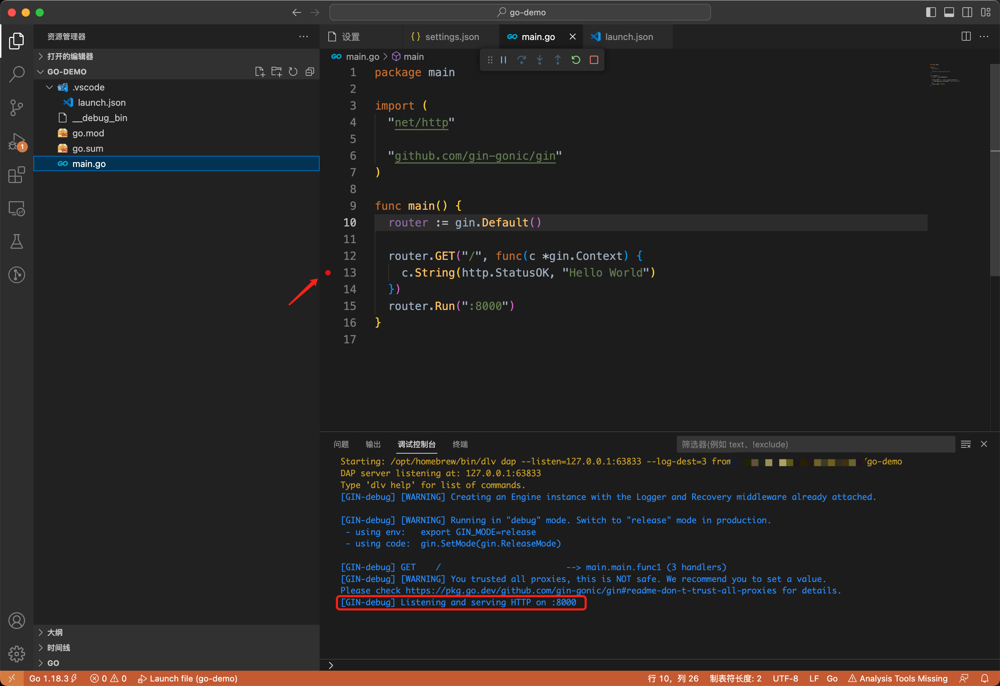

# Gin 在 vscode 中的 debug 配置
通过配置 launch.json 让开发者能够在 vscode 中进行断点调试

## launch.json 配置
```json
{
  // 使用 IntelliSense 了解相关属性。 
  // 悬停以查看现有属性的描述。
  // 欲了解更多信息，请访问: https://go.microsoft.com/fwlink/?linkid=830387
  "version": "0.2.0",
  "configurations": [
    {
      "name": "Launch file",
      "type": "go",
      "request": "launch",
      "mode": "auto",
      "program": "main.go"
    }
  ]
}
```
## 启动测试
可以直接按 F5 直接快捷启动调试，可以通过点击代码左侧添加断点

