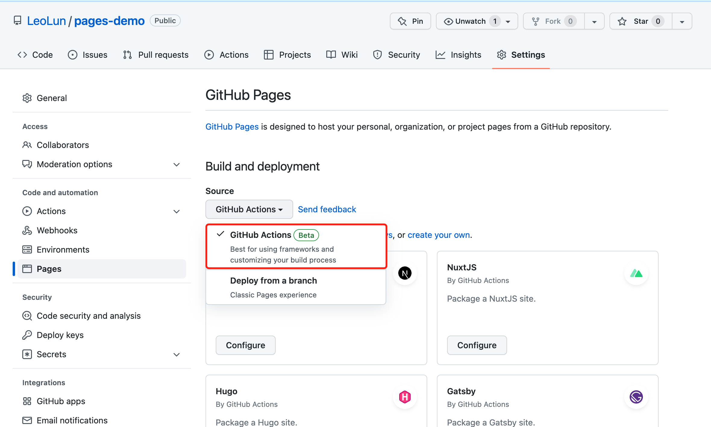

# 如何通过 Github Actions 部署 Github Pages

## 介绍

本文介绍了如何通过 Github Actions 部署一个 Github Pages

DEMO 以 Vue 默认模版为例

<!-- DEMO 地址: [https://github.com/LeoLun/pages-demo](https://github.com/LeoLun/pages-demo) -->

#### 基础概念

[Github Pages 是通过 GitHub 托管和发布的公共网页。](https://docs.github.com/cn/pages)

[GitHub Actions 是一种持续集成和持续交付 (CI/CD) 平台，可用于自动执行生成、测试和部署管道。](https://docs.github.com/cn/actions)

#### 基本流程


## 一、开启 Github Pages



在 settings → Pages → Build and deployment 选择开启 GitHub Actions。

## 二、添加 Github Actions 配置

项目中添加 .github/workflows/build-and-deploy.yml 文件


### npm
```yaml
# build-and-deploy.yml 文件
name: build-and-deploy

on:
  # Trigger the workflow every time you push to the `main` branch
  push:
    branches: [main]
  # Allows you to run this workflow manually from the Actions tab on GitHub.
  workflow_dispatch:

# Allow this job to clone the repo and create a page deployment
permissions:
  contents: read
  pages: write
  id-token: write

jobs:
  build:
    runs-on: ubuntu-latest
    steps:
      - name: Check out your repository using git
        uses: actions/checkout@v3

      - name: Use Node.js 16
        uses: actions/setup-node@v3
        with:
          node-version: '16'
          cache: 'npm'
          cache-dependency-path: '**/package-lock.json'

      - name: Install dependencies
        run: npm ci

      - name: Build
        run: npm run build

      - name: Upload artifact
        uses: actions/upload-pages-artifact@v1
        with:
          path: ./dist

  deploy:
    environment:
      name: github-pages
      url: ${{ steps.deployment.outputs.page_url }}
    runs-on: ubuntu-latest
    needs: build
    steps:
      - name: Deploy to GitHub Pages
        id: deployment
        uses: actions/deploy-pages@v1
```

### pnpm
```yaml
name: build-and-deploy

on:
  # Trigger the workflow every time you push to the `main` branch
  push:
    branches: [main]
  # Allows you to run this workflow manually from the Actions tab on GitHub.
  workflow_dispatch:

# Allow this job to clone the repo and create a page deployment
permissions:
  contents: read
  pages: write
  id-token: write

jobs:
  build:
    runs-on: ubuntu-latest
    steps:
      - name: Check out your repository using git
        uses: actions/checkout@v3

      - name: Install Node.js
        uses: actions/setup-node@v3
        with:
          node-version: 16

      - uses: pnpm/action-setup@v2
        name: Install pnpm
        id: pnpm-install
        with:
          version: 7
          run_install: false

      - name: Get pnpm store directory
        id: pnpm-cache
        shell: bash
        run: |
          echo "STORE_PATH=$(pnpm store path)" >> $GITHUB_OUTPUT

      - uses: actions/cache@v3
        name: Setup pnpm cache
        with:
          path: ${{ steps.pnpm-cache.outputs.STORE_PATH }}
          key: ${{ runner.os }}-pnpm-store-${{ hashFiles('**/pnpm-lock.yaml') }}
          restore-keys: |
            ${{ runner.os }}-pnpm-store-

      - name: Install dependencies
        run: pnpm install --frozen-lockfile

      - name: Build
        run: npm run docs:build

      - name: Upload artifact
        uses: actions/upload-pages-artifact@v1
        with:
          path: ./dist

  deploy:
    environment:
      name: github-pages
      url: ${{ steps.deployment.outputs.page_url }}
    runs-on: ubuntu-latest
    needs: build
    steps:
      - name: Deploy to GitHub Pages
        id: deployment
        uses: actions/deploy-pages@v1
```

## 三、等待执行完毕

打开 Actions 页面，查看执行状态；待 Actions 执行完毕后，打开地址查看构建和部署效果。

## 参考资料

[1] Create a No-Touch QR Code Menu with GitHub Pages: [https://dev.to/github/create-a-no-touch-qr-code-menu-with-github-pages-288b](https://dev.to/github/create-a-no-touch-qr-code-menu-with-github-pages-288b)

[2] setup-node: [https://github.com/actions/setup-node](https://github.com/actions/setup-node)

[3] deploy-pages: [https://github.com/actions/deploy-pages](https://github.com/actions/deploy-pages)

[4] actions-gh-pages: [https://github.com/peaceiris/actions-gh-pages](https://github.com/peaceiris/actions-gh-pages)

[5] Github Pages: [https://docs.github.com/cn/pages](https://docs.github.com/cn/pages/quickstart)

[6] Github Actions: [https://docs.github.com/cn/actions](https://docs.github.com/cn/actions)