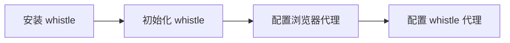
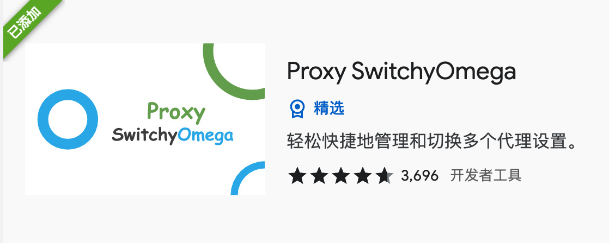
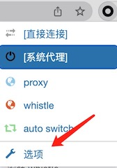
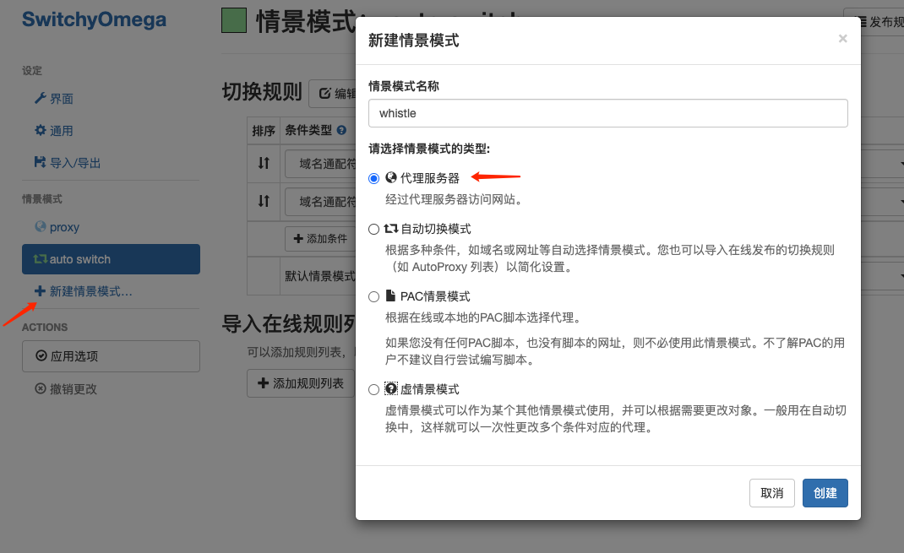
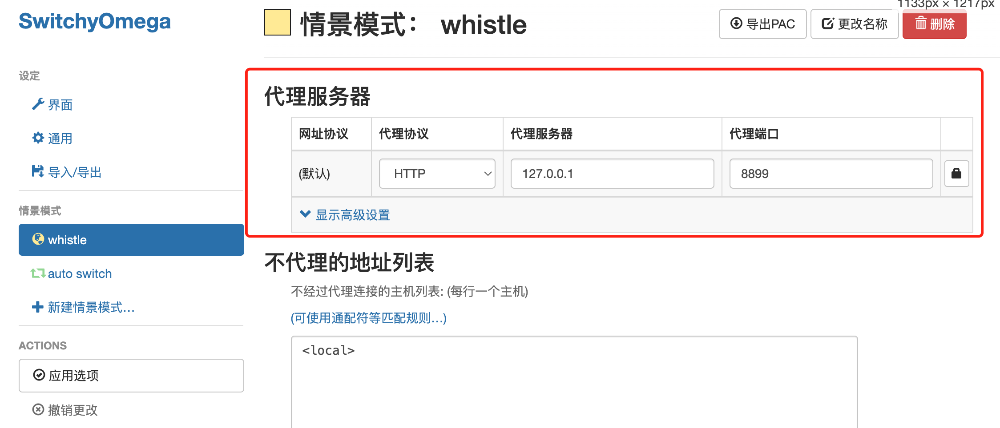
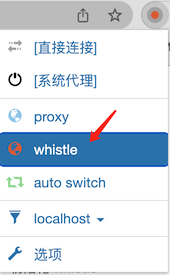
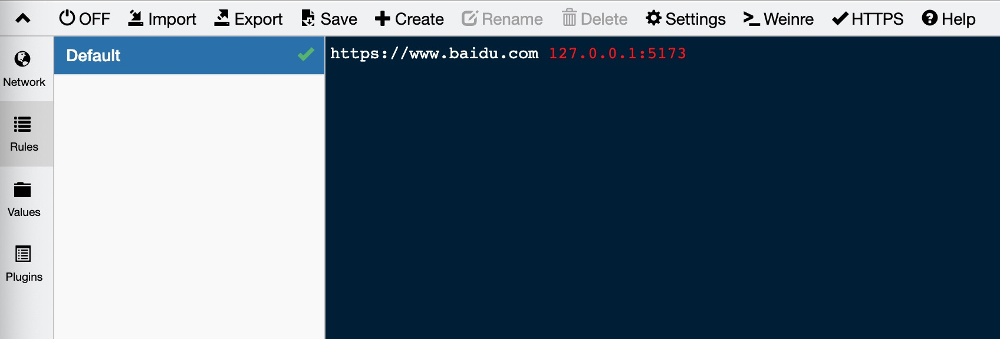
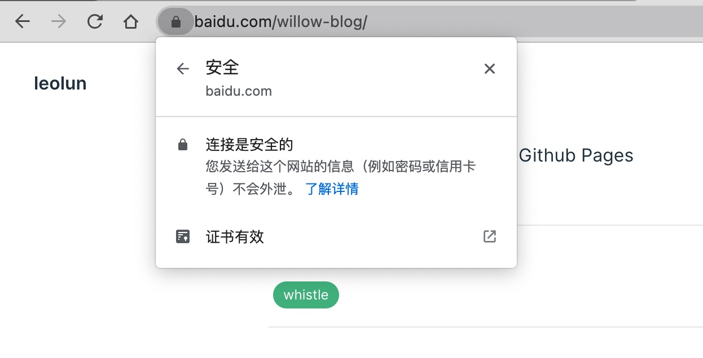

# 基于 whistle 的本地 HTTPS 调试 
## 介绍
一般来说前端服务需要部署指定域名下面，并且需要开启HTTPS。而在本地开发的时候，通常因为安全等问题，前端开发并不能拿到 SSL 证书。为了模拟真实的线上环境，在本地开发的时候就需要让当前机器信任自签证书。

本文基于上述问题，介绍了如何在 Chrome 上基于 whistle 进行本地 HTTPS 调试。

#### 基本概念
whistle: 基于 Node 实现的跨平台抓包调试工具

[项目地址](https://github.com/avwo/whistle)
&nbsp;
[文档地址](https://wproxy.org/whistle/)

#### 基本流程


## 安装 whistle
```shell
npm i -g whistle
```
上述命令会全局安装 whistle `需要 node 环境`
## 初始化 whistle
安装完毕后，需要初始化 whistle, 包括启动和安装根证书。

### 一键初始化
```shell
w2 start --init
```
上述命令会:
1. 启动 whistle;
2. <font color="red">设置全局代理;</font>
3. 安装系统根证书;

由于设置了全局代理，所以会导致关闭 whistle 后无法访问网络；

若不需要全局代理可以关闭。
```shell
w2 proxy off
```

### 手动初始化
1. 启动 whistle
```shell
w2 start
```
2. 安装 whistle 根证书
```shell
w2 ca
```

## 配置浏览器代理
前端开发需要浏览器代理即可，所以不需要开启全局代理；下面介绍如何开启浏览器代理。

### 安装 Proxy SwitchyOmega

### 添加 whistle 情景模式
1. 打开 Proxy SwitchyOmega 选项

2. 新建 whistle 情景模式

3. 配置代理服务器

4. 开启代理


## 添加域名代理
下面以 www.baidu.com 进行代理测试；

打开 https://local.whistlejs.com/ 添加配置

将需要绑定的域名与本地端口绑定


然后打开对应的域名, 可以看到域名已经代理成本地的页面，并且证书也是正确的
