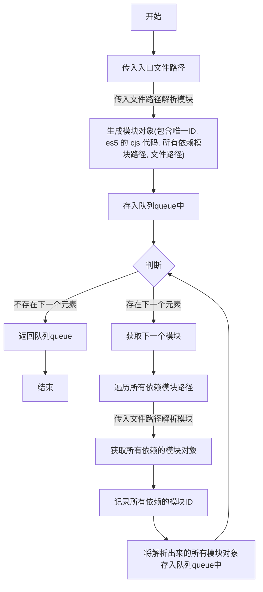
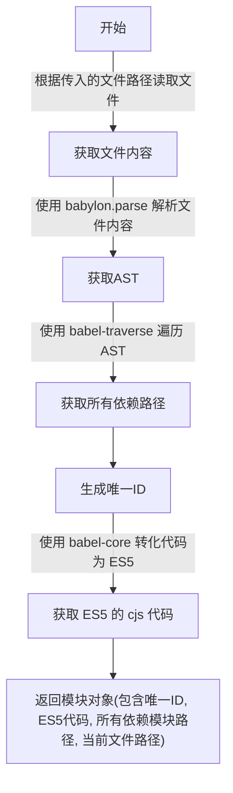
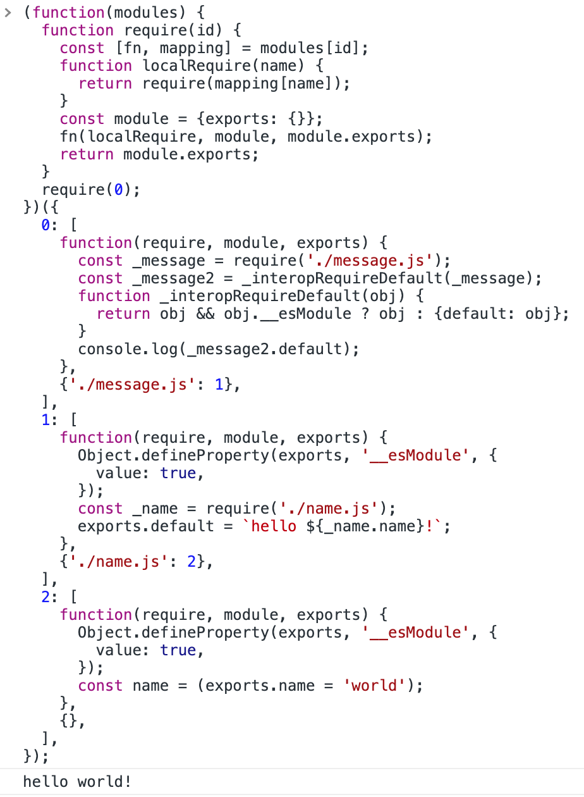

# Webapck 基本原理

## 介绍
本文通过解读 [minipack](https://github.com/chinanf-boy/minipack-explain) 来介绍 webpack 是如何将一个个代码模块, 转化成浏览器运行的代码; 下面以 minipack 的例子中的三个模块进行解析。

模块代码如下:
```js
// ./example/entry.js
import message from './message.js';
console.log(message);
```
```js
// ./example/message.js
import {name} from './name.js';
export default `hello ${name}!`;
```
```js
// ./example/name.js
export const name = 'world';
```

### 总体流程
总体流程分为两步
1. 构建依赖图
2. 打包代码

具体代码如下:
```js
// 构建依赖图, 传入入口文件路径
const graph = createGraph('./example/entry.js');
// 打包代码
const result = bundle(graph);
```

## 1. 创建依赖图
通过传入的入口模块路径, 进行解析模块
1. 获取文件内容
2. 生成唯一 ID
3. 生成 ast
4. 解析 ast 获取所以依赖模块路径
5. 将 ast 转化为 es5 和 commonjs 的代码
6. 保存所以依赖模块的唯一ID

将依赖模块继续进行上面的解析, 通过广度搜索的方式, 遍历所有的模块, 生成完整的依赖图。

### 1.1 生成依赖图


```js
// 伪代码如下, 具体代码查看 minipack
function createGraph(entry) {
  // 通过入口文件路径解析出模块对象
  const mainAsset = createAsset(entry);
  // 存入队列queue中
  const queue = [mainAsset];

  for (const asset of queue) {
    // 存在下一个元素

    // 用于保存依赖的模块ID
    asset.mapping = {};

    // 遍历所有依赖模块路径
    asset.dependencies.forEach(relativePath => {
      // 获取依赖模块对象
      // 生成绝对路径
      const absolutePath = path.join(asset.path, relativePath);
      // 生成模块对象
      const child = createAsset(absolutePath);
      // 记录模块ID
      asset.mapping[relativePath] = child.id;
      // 存入队列queue中
      queue.push(child);
    })
  }
}
```
### 1.2 解析模块
上述过程中的解析模块流程如下



```js
// 伪代码如下, 具体代码查看 minipack
function createAsset(filePath) {
  // 根据传入的文件路径读取文件
  const content = fs.readFileSync(filePath, 'utf-8');
  // 使用 babylon.parse 解析文件内容
  const ast = babylon.parse(content);
  // 使用 babel-traverse 遍历
  const dependencies = getDep(ast);
  // 生成唯一ID
  const id = createId();
  // 使用 babel-core 转化代码为 ES5
  const code = createCode(ast);
  return {
    id,
    filePath,
    dependencies,
    code,
  }
}
```

### 1.3 具体依赖图
将例子中的三个模块构建依赖图的后的数组如下:
```js
[
  {
    id: 0,
    filename: './example/entry.js',
    dependencies: [ './message.js' ],
    code: '"use strict";\n' +
      '\n' +
      'var _message = require("./message.js");\n' +
      '\n' +
      'var _message2 = _interopRequireDefault(_message);\n' +
      '\n' +
      'function _interopRequireDefault(obj) { return obj && obj.__esModule ? obj : { default: obj }; }\n' +
      '\n' +
      'console.log(_message2.default);',
    mapping: { './message.js': 1 }
  },
  {
    id: 1,
    filename: 'example/message.js',
    dependencies: [ './name.js' ],
    code: '"use strict";\n' +
      '\n' +
      'Object.defineProperty(exports, "__esModule", {\n' +
      '  value: true\n' +
      '});\n' +
      '\n' +
      'var _name = require("./name.js");\n' +
      '\n' +
      'exports.default = "hello " + _name.name + "!";',
    mapping: { './name.js': 2 }
  },
  {
    id: 2,
    filename: 'example/name.js',
    dependencies: [],
    code: '"use strict";\n' +
      '\n' +
      'Object.defineProperty(exports, "__esModule", {\n' +
      '  value: true\n' +
      '});\n' +
      "var name = exports.name = 'world';",
    mapping: {}
  }
]
```
## 2. 打包代码
将上述生成的依赖图打包成最终的代码, 还需要经过两个步骤
1. 将代码包装成函数, 注入 cjs 的属性 require, module, exports;
2. 生成 require 函数, 并执行入口文件的函数。

### 2.1 包装各模块代码
```js
// 伪代码如下, 具体代码查看 minipack
// 保存所有模块代码
let modules = '';
// 遍历上述生成的依赖图对象
graph.forEach(mod => {
  // 以唯一 ID 为 key, 将每个模块的代码使用方法进行包装, 并记录依赖地址, 方面后续 require 查找
  modules += `${mod.id}: [
    function (require, module, exports) { ${mod.code} },
    ${JSON.stringify(mod.mapping)},
  ],`;
})
```
包装完后的代码如下
```js
let modules = `0: [
    function (require, module, exports) {
      "use strict";
      var _message = require("./message.js");
      var _message2 = _interopRequireDefault(_message);
      function _interopRequireDefault(obj) { return obj && obj.__esModule ? obj : { default: obj }; }
      console.log(_message2.default);
    },
    { "./message.js": 1 },
  ],
1: [
    function (require, module, exports) { "use strict";
      Object.defineProperty(exports, "__esModule", {
        value: true
      });
      var _name = require("./name.js");
      exports.default = "hello " + _name.name + "!";
    },
    { "./name.js": 2 },
],
2: [
    function (require, module, exports) { "use strict";
      Object.defineProperty(exports, "__esModule", {
        value: true
      });
      var name = exports.name = 'world'; 
    },
    {},
],`
```

### 2.2 打包代码
```js
const result = `
  // 生成一个 IIFT, 传入上面包装好的模块对象
  (function(modules) {
    // 生成 require 方法, 传入需要获取的模块 ID
    function require(id) {
      // 获取包装好的方法和依赖映射
      const [fn, mapping] = modules[id];

      // 生成当前 require 方法, 根据依赖映射获取模块
      function localRequire(name) {
        // 例如: mapping = { "./message.js": 1 },
        // 当 require("./message.js") 时,
        // 将 ./message.js 转换为唯一模块 ID: 1,
        // 即 require(1),
        return require(mapping[name]);
      }

      // 生成 CJS 需要的 module 和 module.exports
      const module = { exports : {} };

      // 执行包装好的代码
      fn(localRequire, module, module.exports); 

      // 返回 module.exports
      return module.exports;
    }

    // 直接执行入口文件的模块
    require(0);
  })({${modules}})
`;
```

### 2.3 最终代码
经过打包后最终生成的代码如下:
```js
(function(modules) {
  function require(id) {
    const [fn, mapping] = modules[id];
    function localRequire(name) {
      return require(mapping[name]);
    }
    const module = {exports: {}};
    fn(localRequire, module, module.exports);
    return module.exports;
  }
  require(0);
})({
  0: [
    function(require, module, exports) {
      const _message = require('./message.js');
      const _message2 = _interopRequireDefault(_message);
      function _interopRequireDefault(obj) {
        return obj && obj.__esModule ? obj : {default: obj};
      }
      console.log(_message2.default);
    },
    {'./message.js': 1},
  ],
  1: [
    function(require, module, exports) {
      Object.defineProperty(exports, '__esModule', {
        value: true,
      });
      const _name = require('./name.js');
      exports.default = `hello ${_name.name}!`;
    },
    {'./name.js': 2},
  ],
  2: [
    function(require, module, exports) {
      Object.defineProperty(exports, '__esModule', {
        value: true,
      });
      const name = (exports.name = 'world');
    },
    {},
  ],
});
```
将代码直接粘贴到控制台运行


## 参考资料
[1] minipack: [https://github.com/chinanf-boy/minipack-explain](https://github.com/chinanf-boy/minipack-explain)
