# 微信小程序初始化配置
本文介绍如何新建微信小程序并初始化相关配置，包括 eslint、husky、使用 miniprogram-ci 预览和上传小程序、使用 standard-changelog 生成 changelog 等。

本文主要使用 `pnpm` 进行包管理，可按需求自行换成 `npm`,`yarn`。


项目地址: [willow-tools](https://github.com/LeoLun/willow-tools)


## 1 新建项目
打开微信开发者工具，新建小程序，选择 TS + Sass 基础模版

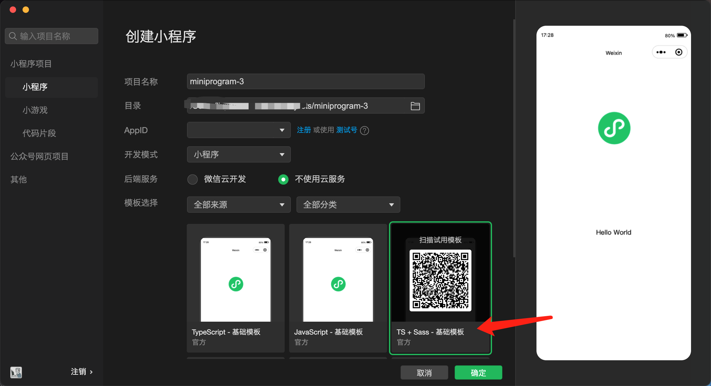

个人喜欢将默认的 `miniprogram` 目录修改为 `src`
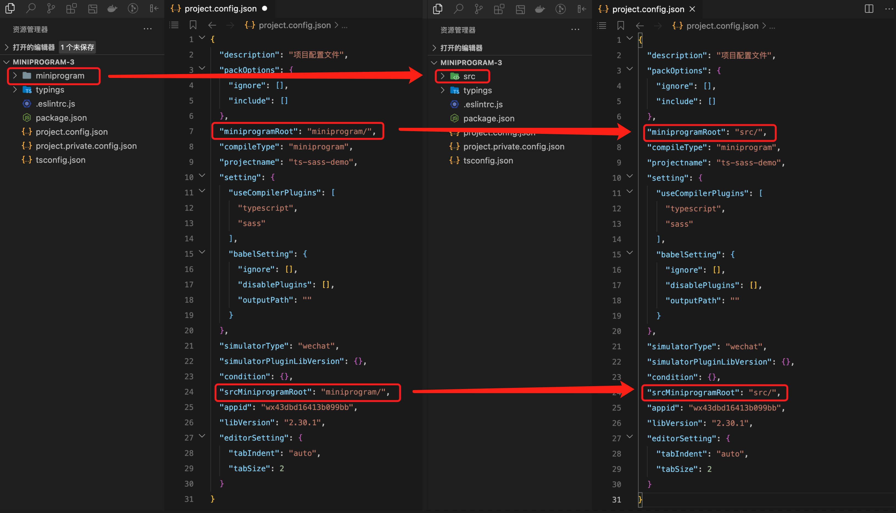


## 2 eslint 配置
添加 eslint 相关配置，并配置格式化。
### 2.1 添加 npm 包
这里使用 airbnb 的规范
具体的 `package.json` 如下:
```json
{
  "name": "willow-tools",
  "version": "1.0.0",
  "scripts": {
    "lint": "eslint --ext .ts src"
  },
  "keywords": [],
  "author": "",
  "license": "ISC",
  "devDependencies": {
    "@typescript-eslint/eslint-plugin": "^5.52.0",
    "@typescript-eslint/parser": "^5.52.0",
    "eslint": "^7.32.0",
    "eslint-config-airbnb-base": "^15.0.0",
    "eslint-config-airbnb-typescript": "^17.0.0",
    "eslint-plugin-import": "^2.27.5",
    "miniprogram-api-typings": "^3.6.0",
    "typescript": "^4.9.5"
  },
  "description": ""
}
```
然后执行 `pnpm install` 安装相关依赖。
### 2.2 修改和添加相关配置文件
修改 `.eslintrc.js` 文件
```js
// .eslintrc.js
module.exports = {
  env: {
    browser: true,
    es2021: true,
    node: true,
  },
  extends: [
    'airbnb-base',
    'airbnb-typescript/base',
  ],
  parserOptions: {
    ecmaVersion: 2021,
    sourceType: 'module',
    project: './tsconfig.eslint.json',
  },
  globals: {
    wx: true,
    App: true,
    Page: true,
    getCurrentPages: true,
    getApp: true,
    Component: true,
    requirePlugin: true,
    requireMiniProgram: true,
  },
  rules: {},
};
```
新建 `tsconfig.eslint.json` 文件
```json
// tsconfig.eslint.json
{
  "extends": "./tsconfig.json",
  "include": [
    "src",
    ".eslintrc.js",
  ]
}
```
### 2.3 eslint 插件安装与配置
#### 2.3.1 安装插件
打开微信开发者工具，选择扩展，安装 eslint 插件
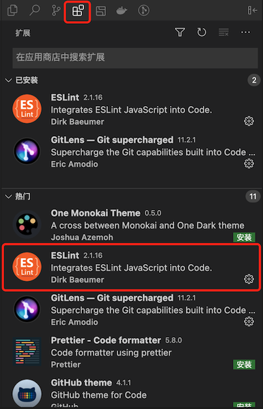

#### 2.3.2 添加格式化配置
下面介绍单个项目添加和整个编译器添加，根据自身要求选择一种即可。


单个项目添加: 给项目添加 `.vscode/settings.json` 文件，内容如下
```json
{
	"eslint.format.enable": true,
	"editor.formatOnSave": false,
	"editor.codeActionsOnSave": {
	  "source.fixAll.eslint": true
	 },
	 "[typescript]": {
	   "editor.defaultFormatter": "dbaeumer.vscode-eslint"
	 },
	 "[javascript]": {
	   "editor.defaultFormatter": "dbaeumer.vscode-eslint"
	 }
}
```

编译器整体添加: 打开 设置-编译器设置-更多编译器设置，然后点击打开设置按钮，如下:
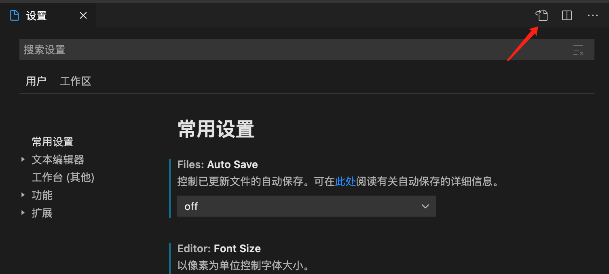

然后在配置文件中追加下面内容:
```json
"eslint.format.enable": true,
"editor.formatOnSave": false,
"editor.codeActionsOnSave": {
  "source.fixAll.eslint": true
 },
 "[typescript]": {
   "editor.defaultFormatter": "dbaeumer.vscode-eslint"
 },
 "[javascript]": {
   "editor.defaultFormatter": "dbaeumer.vscode-eslint"
 }
```
#### 2.3.3 允许 eslint 访问权限
建议重启微信开发者工具，检查右下角 eslint 是否正常运行；首次使用需要授权 eslint 插件访问文件，点击右下角的 eslint；然后运行访问即可。
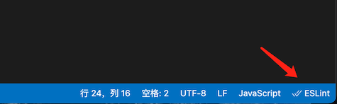
### 2.4 检查是否配置成功
#### 2.4.1 测试 eslint 配置成功
运行 `pnpm run lint`, 可以正确识别 eslint 错误
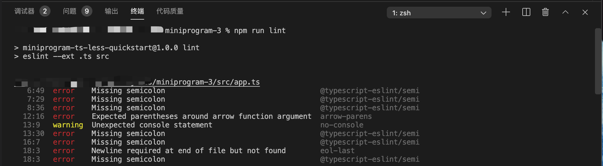
#### 2.4.2 编译器正确识别 eslint 错误
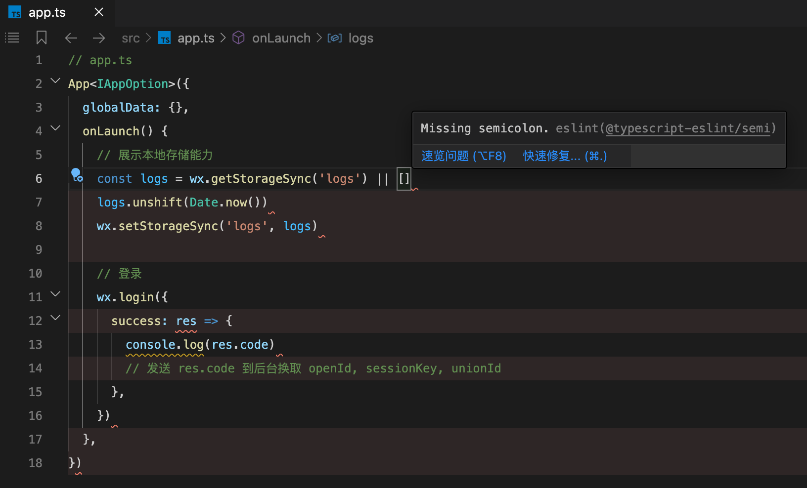
#### 2.4.3 保存和格式化代码可自动修复 eslint 错误
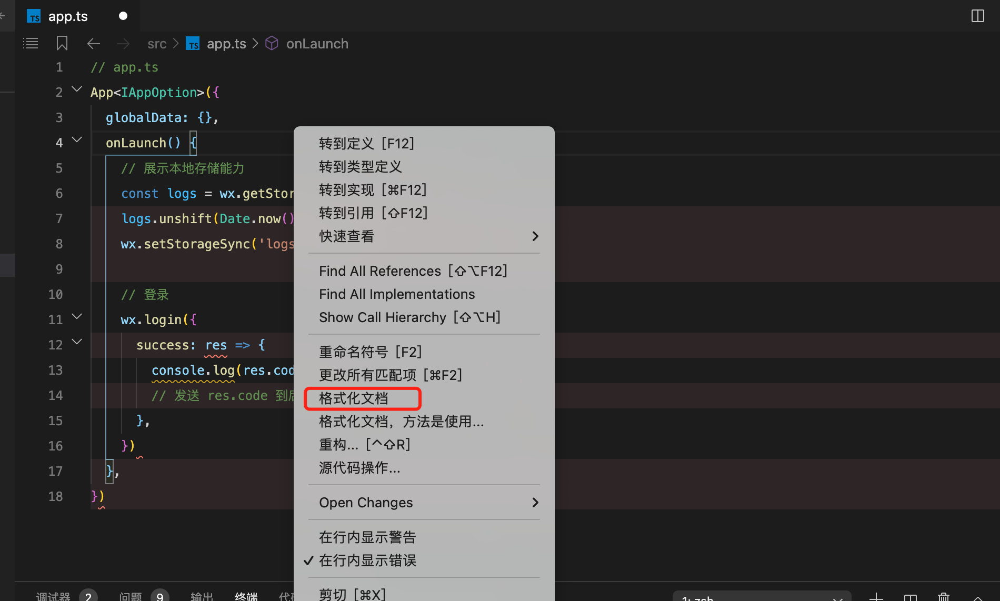

## 3 stylelint 配置

### 3.1 npm 包安装
```shell
pnpm install --save-dev stylelint stylelint-config-standard-scss
```

### 3.2 添加 .stylelintrc.js 配置文件
```js
module.exports = {
  extends: [
    'stylelint-config-standard-scss'
  ],
  rules: {
    'unit-no-unknown': [true, { ignoreUnits: ['rpx'] }],
    'selector-type-no-unknown': [true, { ignoreTypes: ['page']}]
  }
}
```

### 3.3 添加 package.json
```json
"scripts": {
  "lint": "pnpm run lint:js && pnpm run lint:css",
  "lint:js": "eslint '{src,scripts}/**/*.{js,ts}'",
  "lint:css": "stylelint '**/*.scss'"
},
```

### 3.4 测试
运行 `pnpm run lint`
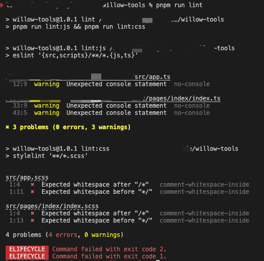

#### 由于微信小程序开发工具无法支持 stylelint 插件，所以下面是 vscode 的自动化格式配置
安装 `stylelint` 插件


添加设置
```json
"eslint.format.enable": true,
"editor.formatOnSave": false,
"editor.codeActionsOnSave": {
  "source.fixAll.eslint": true,
  "source.fixAll.stylelint": true
},
"stylelint.validate": [
  "css",
  "less",
  "postcss",
  "scss"
],
```
配置完成后即可在 vscode 中自动化格式化

## 4 husky 配置
添加 husky, 处理 git hook 相关事件。
### 4.1 安装 husky
安装 npm 包
```shell
pnpm install husky -D
```
在 package.json 添加 prepare
```json
"scripts": {
  "lint": "pnpm run lint:js && pnpm run lint:css",
  "lint:js": "eslint '{src,scripts}/**/*.{js,ts}'",
  "lint:css": "stylelint '**/*.scss'",
  "prepare": "husky install"
}
```
prepare 会在 `pnpm install` 后自动执行，手动执行下 `pnpm install` 触发 `husky install`
```shell
pnpm install
```
husky install 会创建 .husky/ 目录并指定该目录为git hooks 所在的目录。

### 4.2 添加 pre-commit
`pre-commit` 会在 `git commit` 命令前执行。

结合上述 eslint 配置，可以使 `git commit` 命令前执行 `pnpm run lint`, 若不能通过 eslint 检查，则无法 commit 代码。

具体配置如下: 

执行下面命令在 .husky/ 目录下生成 pre-commit 的脚本。
```shell
pnpm husky add .husky/pre-commit "pnpm run lint"
```
自动生成的 pre-commit 脚本如下:
```shell
#!/usr/bin/env sh
. "$(dirname -- "$0")/_/husky.sh"

pnpm run lint
```

### 4.3 添加 commit-msg
commit-msg 会在 pre-commit 之后检查 commit 的文本内容。这里结合 [config-conventional](https://www.npmjs.com/package/@commitlint/config-conventional) 为判断提交的 commit 文本是否符合规范。

具体配置如下: 

执行下面命令在 .husky/ 目录下生成 commit-msg 的脚本。
```shell
pnpm husky add .husky/commit-msg 'npx --no-install commitlint --edit ""'
```
安装 commitlint 相关包
```shell
pnpm install --save-dev @commitlint/config-conventional @commitlint/cli
```
执行下面命令生成 commitlint.config.js 文件
```shell
echo "module.exports = {extends: ['@commitlint/config-conventional']};" > commitlint.config.js
```
### 4.4 测试 husky 是否生效
#### 4.4.1 测试 pre-commit
当 eslint 错误时将报错, 无法提交
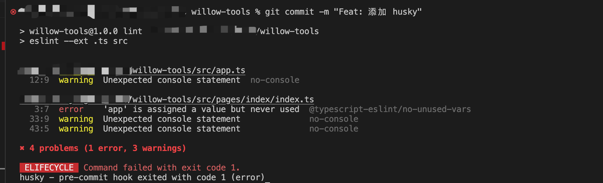
#### 4.4.2 测试 commit-msg
commit 信息输入不符合规范的信息，如: `Feat: 测试`。将会报错，无法提交
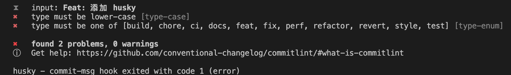

## 5 使用 standard-changelog 生成 changelog
当设置了相关 commit 规范后, 可以使用`standard-changelog`根据 commit 的文本自动生成 changelog

相关代码复制至 [tdesign-miniprogram](https://github.com/Tencent/tdesign-miniprogram/blob/develop/script/generate-changelog.js)

添加 `scripts/generate-changelog.js` 文件
```js
// scripts/generate-changelog.js
// copy by https://github.com/Tencent/tdesign-miniprogram/blob/develop/script/generate-changelog.js
const { execSync } = require('child_process');
const fs = require('fs');
const readline = require('readline');
const standardChangelog = require('standard-changelog');
const pkg = require('../package.json');

const VERSION_REG = /\d+\.\d+\.\d+/;

function updateVersion() {
  return new Promise((resolve) => {
    const rl = readline.createInterface({ input: process.stdin, output: process.stdout });

    rl.setPrompt(`当前 package.json 版本号为: ${pkg.version}\n请输入本次要发布的版本号:(可按回车跳过)\n`);
    rl.prompt();

    // eslint-disable-next-line consistent-return
    rl.on('line', (input) => {
      let newVersion = '';
      if (!input) {
        newVersion = pkg.version.replace(/(\d+\.\d+\.)(\d+)/, (verion, $1, $2) => $1 + (Number($2) + 1));
      } else if (!VERSION_REG.test(input)) {
        console.log('\x1B[31m%s\x1B[0m', '\n⚡ 不要搞事年轻人，请输入正确版本号格式!\n');
        rl.prompt();
        return;
      } else {
        newVersion = input;
      }
      const newPkg = JSON.stringify({ ...pkg, version: newVersion }, null, 2);
      fs.writeFileSync('package.json', `${newPkg}\n`, 'utf8');
      console.log('\x1B[32m%s\x1B[0m', '\n🎉 good job! package.json 文件已更新.\n');
      rl.close();
    });

    rl.on('close', resolve);
  });
}

function getLastChangeLogCommit() {
  const gitCommand = 'git blame CHANGELOG.md';
  const changeLogCommits = execSync(gitCommand, {
    cwd: process.cwd(),
    encoding: 'utf-8',
  }).split('\n');

  return changeLogCommits.find((cmt) => VERSION_REG.test(cmt)).slice(0, 8);
}

function getGitCommitMap(lastCommit) {
  const gitCommand = `git log --pretty=format:"%H:%cn" ${lastCommit}..HEAD`;
  const gitLogMap = execSync(gitCommand, { cwd: process.cwd(), encoding: 'utf-8' }).toString();
  fs.writeFileSync('.gitlogmap', gitLogMap, 'utf8');
}

async function updateChangeLog() {
  await updateVersion();

  console.log('\x1B[32m%s\x1B[0m', '正在生成 changeLog... \n');

  const lastCommit = getLastChangeLogCommit();
  const initialChangelogStr = fs.readFileSync('CHANGELOG.md', 'utf8');

  const pageDataStr = `${initialChangelogStr.match(/---[\s\S]+---/)[0]}\n`;
  const data = initialChangelogStr.split(/---[\s\S]+---/);
  data.unshift(pageDataStr);
  new Promise((resolve) => {
    standardChangelog({}, null, { from: lastCommit, to: 'HEAD' })
      .on('data', (chunk) => {
        let changeLogStr = chunk.toString().trim();
        changeLogStr = changeLogStr.replace(/\(([\d-]+)\)/g, '`$1`');
        changeLogStr = changeLogStr.replace(/^#\s/g, '## ').trim();
        data.splice(1, 0, `${changeLogStr}\n`);
      })
      .on('end', resolve);
  }).then(() => {
    getGitCommitMap(lastCommit);
    const writeStream = fs.createWriteStream('CHANGELOG.md', 'utf8');
    writeStream.write(data.join('\n'));
    writeStream.end();

    console.log('\x1B[32m%s\x1B[0m', '已生成最新 changeLog... 请打开 CHANGELOG.md 确认');
  });
}

updateChangeLog();
```

eslint 添加 scripts 目录检查， 修改 `tsconfig.eslint.json`
```json
{
  "extends": "./tsconfig.json",
  "include": [
    "src",
    "scripts",
    "commitlint.config.js",
    ".eslintrc.js"
  ]
}
```
添加 package.json 命令
```json
"scripts": {
  "lint": "pnpm run lint:js && pnpm run lint:css",
  "lint:js": "eslint '{src,scripts}/**/*.{js,ts}'",
  "lint:css": "stylelint '**/*.scss'",
  "prepare": "husky install",
  "changelog": "node scripts/generate-changelog.js"
},
```
添加 CHANGELOG.md 文件
```
---
title: 更新日志
spline: explain
toc: false
docClass: timeline
---

```
执行命令修改版本号，并生成 changelog 记录
```shell
pnpm run changelog
```

具体效果查看: [willow-tools/CHANGELOG.md](https://github.com/LeoLun/willow-tools/blob/main/CHANGELOG.md)

## 6 使用 miniprogram-ci 预览和上传小程序
前提需要生成小程序密钥和关闭白名单。具体操作参考: [密钥及 IP 白名单配置](https://developers.weixin.qq.com/miniprogram/dev/devtools/ci.html)

使用 miniprogram-ci 来生成预览二维码和上传小程序

### 6.1 安装 `miniprogram-ci` 和 `cross-env`
```shell
pnpm install miniprogram-ci cross-env
```
### 6.2 添加 `scripts/ci.js`
```js
const ci = require('miniprogram-ci');
const path = require('path');
const config = require('../project.config.json');
const pkg = require('../package.json');

const createProject = () => {
  const project = new ci.Project({
    appid: config.appid,
    type: 'miniProgram',
    projectPath: path.resolve(__dirname, '../'),
    // 替换为自己小程序密钥文件
    privateKeyPath: path.resolve(__dirname, '../config/private.xxxxxxx.key'),
    ignores: ['node_modules/**/*'],
  });
  return project;
};

const preview = async (project) => {
  const result = await ci.preview({
    project,
    version: pkg.version,
    desc: '自动化构建',
    robot: 20,
    setting: config.setting,
    qrcodeFormat: 'image',
    qrcodeOutputDest: path.resolve(__dirname, '../config/qrcode.jpg'),
    onProgressUpdate: console.log,
  });
  return result;
};

const upload = async (project) => {
  const result = await ci.upload({
    project,
    version: pkg.version,
    desc: '自动化构建',
    robot: 1,
    setting: config.setting,
    onProgressUpdate: console.log,
  });
  return result;
};

const run = () => {
  const env = process.env.NODE_CI_ENV || 'preview';
  const action = env === 'upload' ? upload : preview;
  const project = createProject();
  const result = action(project);
  console.log(result);
};

run();
```
### 6.3 配置密钥
将获取的密钥文件放到`config`目录中, 并修改上述 `scripts/ci.js` 文件中的 `private.xxxxxxx.key` 为自己的密钥文件名字。

### 6.4 添加 package.json 配置
```json
"scripts": {
  "lint": "pnpm run lint:js && pnpm run lint:css",
  "lint:js": "eslint '{src,scripts}/**/*.{js,ts}'",
  "lint:css": "stylelint '**/*.scss'",
  "prepare": "husky install",
  "changelog": "node scripts/generate-changelog.js",
  "preview": "cross-env NODE_CI_ENV=preview node scripts/ci.js",
  "upload": "cross-env NODE_CI_ENV=upload node scripts/ci.js"
},
```
### 6.5 测试
#### 6.5.1 预览
执行 `pnpm run preview`, 可以看到在 `config` 目录下生成的二维码图片 qrcode.jpg，并且小程序助手上可以看到对应开发版。
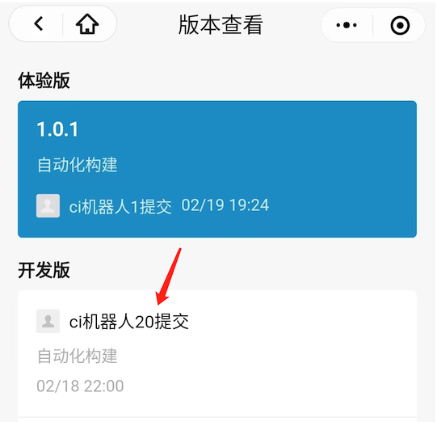
#### 6.5.2 预览
执行 `pnpm run upload`, 可以在小程序助手/微信公众平台查看到对应版本

小程序助手:
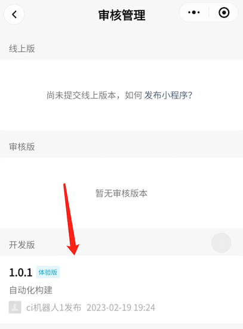
微信公众平台:
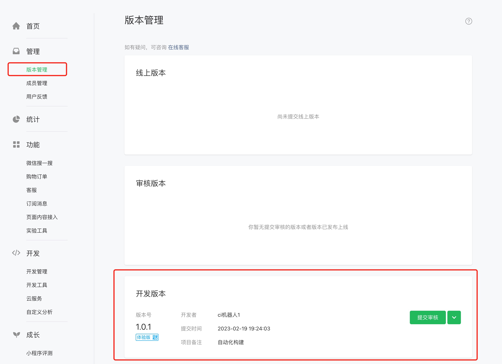
<!-- ## 7 单元测试配置 -->

## 7 github actions 配置
使用 github actions 管理整个 ci/cd 流程
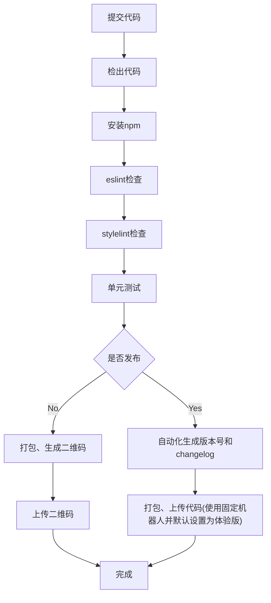
### 8.1 添加 yml 文件

### 8.2 使用 github 的密钥管理小程序密钥

### 8.3 保存预览二维码
