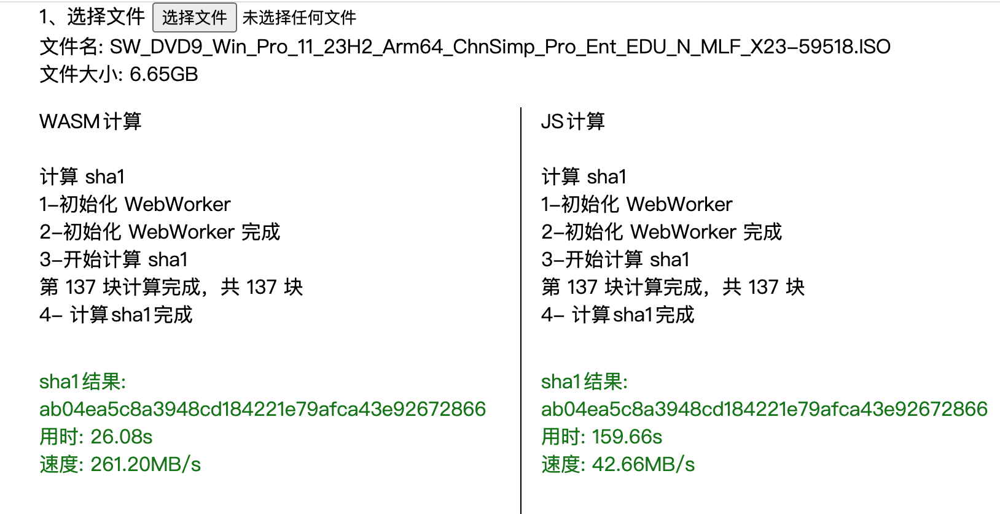

# 使用 WASM 优化 sha1 计算速度

## 介绍
下文介绍如何使用 rust 生成计算 sha1 的 wasm。并对比运行速度

具体项目代码查看[rust-wasm-sha1-demo](https://github.com/LeoLun/rust-wasm-sha1-demo)


## Rust 构建 WASM
通过 wasm-pack 打包，将 rust 的 sha1 库打包成 wasm。

```rust
#![allow(clippy::new_without_default)]
use wasm_bindgen::prelude::*;
use sha1::{Digest, Sha1 as _Sha1};

#[wasm_bindgen]
extern "C" {
    #[wasm_bindgen(js_namespace = console)]
    fn log(s: &str);
}

#[wasm_bindgen]
struct Sha1Hasher {
    hasher: _Sha1,
}

#[wasm_bindgen]
impl Sha1Hasher {
    pub fn new() -> Self {
        Self { hasher: _Sha1::new() }
    }

    pub fn digest(data: &str) -> String {
        let hasher = _Sha1::digest(data.as_bytes());
        format!("{:x}", hasher)
    }

    pub fn digest_u8(data: &[u8]) -> String {
        let hasher = _Sha1::digest(data);
        format!("{:x}", hasher)
    }

    pub fn update(&mut self, data: &[u8]) {
        self.hasher.update(data)
    }

    pub fn finalize(self) -> String {
        format!("{:x}", self.hasher.finalize())
    }
}
```

由于没有使用 webpack 等打包工具，所以要在浏览器中直接使用需要打包成`no-modules`模式，使用下面指令:

```shell
wasm-pack build --target no-modules
```

## 在 WebWorker 中使用 wasm
为计算过程不影响主进程，这里使用 WebWorker 调用 wasm 进行计算。webworker文件如下:
```js
importScripts('./rust_wasm_sha1_demo.js')

const { Sha1Hasher } = wasm_bindgen

function sendProgress(chunkNr, chunks) {
  postMessage({
    type: "progress",
    data: {
      chunkNr,
      chunks
    }
  });
}

function sendResult(result) {
  postMessage({
    type: "result",
    data: result
  });
}

const sha1 = (file) => {
  const hasher = Sha1Hasher.new()
  // 将文件按50M分割
  const chunkSize = 50 * 1024 * 1024;
  const chunks = Math.ceil(file.size / chunkSize);
  // 当前分块序号
  let currentChunk = 0;

  // 对文件进行分块读取
  let fileReader = new FileReader();

  // 加载下一块
  function loadNext() {
    const start = currentChunk * chunkSize;
    const end = start + chunkSize >= file.size ? file.size : start + chunkSize;
    fileReader.readAsArrayBuffer(file.slice(start, end));
  }

  // 读取文件完成
  fileReader.onload = function (e) {
    hasher.update(new Uint8Array(e.target.result));
    sendProgress(currentChunk + 1, chunks);
    currentChunk++;
    if (currentChunk < chunks) {
      loadNext();
    } else {
      sendResult(hasher.finalize());
      hasher.free();
    }
  };

  // 加载第一块
  loadNext();
}


const onMessage = (e) => {
  console.log('onMessage wasm')
  let { file } = e.data;
  sha1(file)
}

async function init_wasm_in_worker() {
  await wasm_bindgen('./rust_wasm_sha1_demo_bg.wasm');
  // 注册消息事件
  self.onmessage = onMessage
  // 返回初始化完成
  self.postMessage({
    type: "ready"
  })
};

init_wasm_in_worker();
```

在主进程中初始化 webworker 并调用计算 sha1
```js
const ComputeSha1ByWasm = async (file) => {
  let startTime = Date.now();
  const worker = new Worker('./wasm-worker.js');
  worker.onmessage = function (e) {
    const { data, type } = e.data;
    if (type === 'ready') {
      worker.postMessage({ file });
    } else if (type === 'progress') {
      console.log(`第 ${data.chunkNr} 块计算完成，共 ${data.chunks} 块`)
    } else if (type === 'result') {
      let endTime = Date.now();
      const useTime = endTime - startTime;
      worker.terminate(); // 关闭worker
    }
  }
}
```

其他具体代码查看[rust-wasm-sha1-demo](https://github.com/LeoLun/rust-wasm-sha1-demo)

## 对比
在 MB(m1pro) 的环境下，计算一个 6.65G 的文件，整体用时降低到 JS 的六分之一。具体结果如下：

