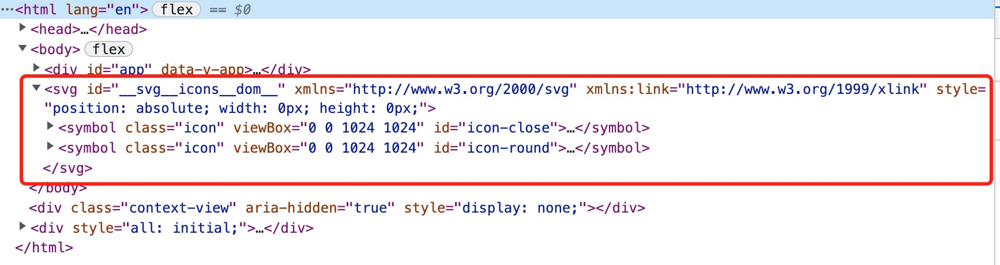
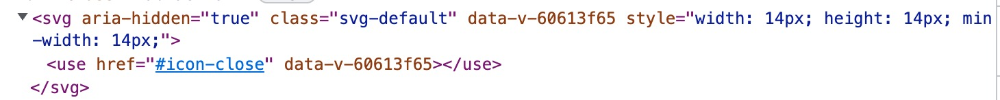

# Vite 图片处理

## 介绍
图片使用主要分为三种方式:
1. Base64
2. 字体图标
3. SVG Sprite

## Base64
将图片文件转换为 Base64 编码, 直接打包到文件中, 减少资源请求, 加快图片展示速度。

因为如果图片太大, 会导致文件太大, 影响加载速度。所以在 vite 中只会自动将小于 4KB 的内联资源文件进行 base64 编码, 打包到文件中, 减少资源请求。

可通过构建选项 [build.assetsinlinelimit](https://cn.vitejs.dev/config/build-options.html#build-assetsinlinelimit) 修改打包阈值。

### 存在问题
无法通过 CSS 修改图标颜色

Base64 的方式可以减少图片请求, 但是如果同一张图片使用多次, 打包多份 Base64 编码进入到文件中。

## 字体图标
将图片转化为字体文件，通过 class 指定字体来使用图片。
以 [iconfont](https://www.iconfont.cn/) 的 font-class 方式为例

```HTML
<span class="iconfont icon-xxx"></span>
```

### 存在问题
因为图标管理在第三方平台，并且每次添加图标都需要替换新字体图标文件，会导致管理和更新复杂。

## SVG Sprite
直接将 SVG 图片插入到 DOM 中

在使用时直接引用 DOM 中的 SVG 节点


### 在 vite 中使用 vite-plugin-svg-icons 来管理 svg 图片

#### 安装
```shell
yarn add vite-plugin-svg-icons -D
# or
npm i vite-plugin-svg-icons -D
# or
pnpm install vite-plugin-svg-icons -D
```

#### 使用插件
在 vite.config.ts 中
```ts
import { createSvgIconsPlugin } from 'vite-plugin-svg-icons'
import path from 'path'

export default () => {
  return {
    plugins: [
      createSvgIconsPlugin({
        // Specify the icon folder to be cached
        iconDirs: [path.resolve(process.cwd(), 'src/icons')],
        // Specify symbolId format
        symbolId: 'icon-[dir]-[name]',

        /**
         * custom insert position
         * @default: body-last
         */
        inject?: 'body-last' | 'body-first'

        /**
         * custom dom id
         * @default: __svg__icons__dom__
         */
        customDomId: '__svg__icons__dom__',
      }),
    ],
  }
}
```

#### 引入文件将 SVG 插入到 DOM 中
在 main.ts 中引入 virtual:svg-icons-register
```ts
// main.ts
import 'virtual:svg-icons-register'
```

#### 使用
直接使用
```html
<svg
  aria-hidden="true"
  class="svg-default"
>
  <use href="#icon-close" />
</svg>
```
或者包装成组件使用
```vue
<!-- 包装成组件 -->
<template>
  <svg aria-hidden="true">
    <use :href="symbolId" :fill="color" />
  </svg>
</template>

<script>
import { defineComponent, computed } from 'vue'

export default defineComponent({
  name: 'SvgIcon',
  props: {
    prefix: {
      type: String,
      default: 'icon',
    },
    name: {
      type: String,
      required: true,
    },
    color: {
      type: String,
      default: '#333',
    },
  },
  setup(props) {
    const symbolId = computed(() => `#${props.prefix}-${props.name}`)
    return { symbolId }
  },
})
</script>

<!-- 使用 -->
<SvgIcon name="icon1"></SvgIcon>
```

#### tips
如果 SVG 图标存在 fill 填充颜色则无法通过 CSS 修改颜色，需要手动去除 fill。

## 参考资料
[1] vite 构建选项: [https://cn.vitejs.dev/config/build-options.html#build-assetsinlinelimit](https://cn.vitejs.dev/config/build-options.html#build-assetsinlinelimit)

[2] vite-plugin-svg-icons: [https://github.com/vbenjs/vite-plugin-svg-icons](https://github.com/vbenjs/vite-plugin-svg-icons)


