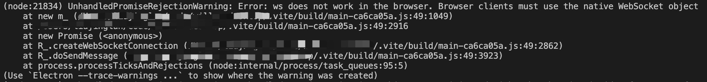
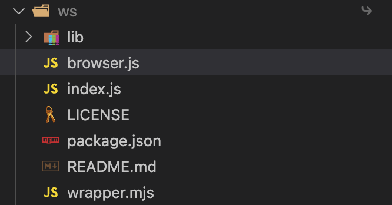
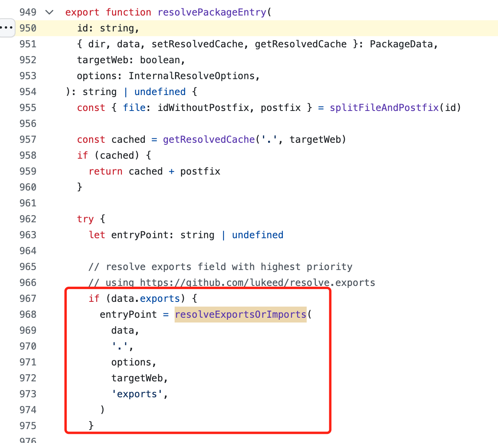
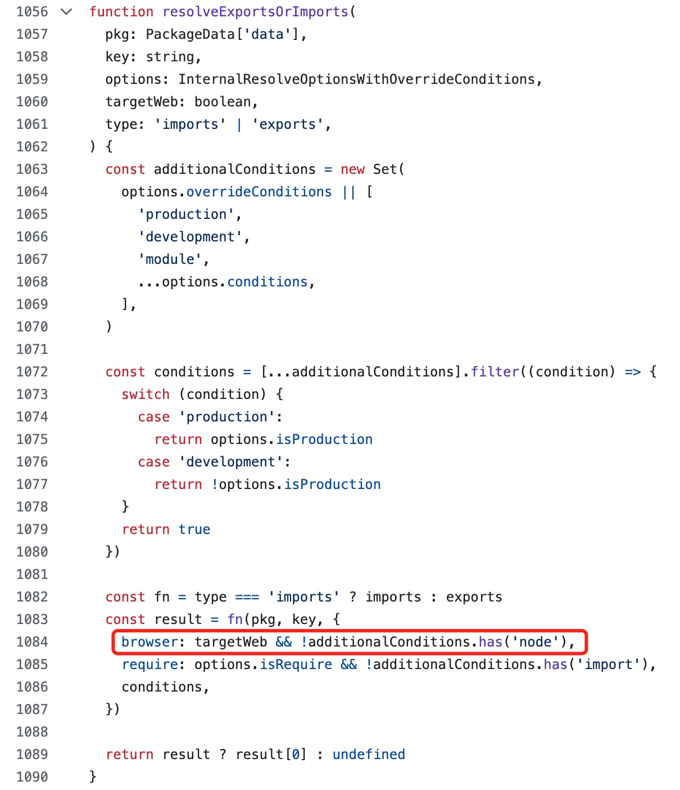

# 在 vite 中使用 ws 模块报错


```ts
import WebSocket from 'ws';
const ws = new WebSocket("xxxxxxx")
```
使用 vite 打包的 node 代码中引用 `ws` 模块并调用会出现下面报错



报错中说明无法在浏览器中调用 WebSocket。

## 分析错误
查看`ws`的代码目录


其中 `browser.js` 中的代码就是上述的报错信息, 内容如下：

```js
'use strict';

module.exports = function () {
  throw new Error(
    'ws does not work in the browser. Browser clients must use the native ' +
      'WebSocket object'
  );
};
```

而 package.json 中，也指出导出了 `browser.js` 文件
```json
  "main": "index.js",
  "exports": {
    ".": {
      "browser": "./browser.js",
      "import": "./wrapper.mjs",
      "require": "./index.js"
    },
    "./package.json": "./package.json"
  },
  "browser": "browser.js",
```

通过上述分析，vite 错误读取了 `package.json` 的入口文件。

## 原因
通过阅读 vite 源码


当 npm 包的 `package.json` 文件，存在 `exports` 时，就会执行 `resolveExportsOrImports`, 寻找入口文件。



在 `resolveExportsOrImports` 中显示当 targetWeb 为 true 且 additionalConditions 不包含 'node' 则使用 brower 模块。

继续找到定义 targetWeb 的位置
```ts
const targetWeb = !ssr || ssrTarget === 'webworker'
```
由于是 node 服务，所以没有开启 SSR。所以 targetWeb 为 true。

所以 vite 会默认导入 brower.js 文件，导致报错。

## 处理方案
### 方案一
在 vite.config.ts 中添加 `conditions: ['node']` 如下：
```ts
import { defineConfig } from 'vite';

// https://vitejs.dev/config
export default defineConfig({
  resolve: {
    conditions: ['node'],
    browserField: false,
    mainFields: ['module', 'jsnext:main', 'jsnext'],
  },
});
```

通过添加上述配置，使 `resolveExportsOrImports` 中的 additionalConditions 包含 'node'，从而不会使用 brower 模块。

### 方案二
通过 alias 配置指定 `ws` 模块的入口文件

```ts
import { defineConfig } from 'vite';
import path from 'node:path'

// https://vitejs.dev/config
export default defineConfig({
  resolve: {
    alias:{
      'ws': path.resolve(path.join(__dirname, 'node_modules/ws/index.js' )) 
    },
    browserField: false,
    mainFields: ['module', 'jsnext:main', 'jsnext'],
  },
});

```


